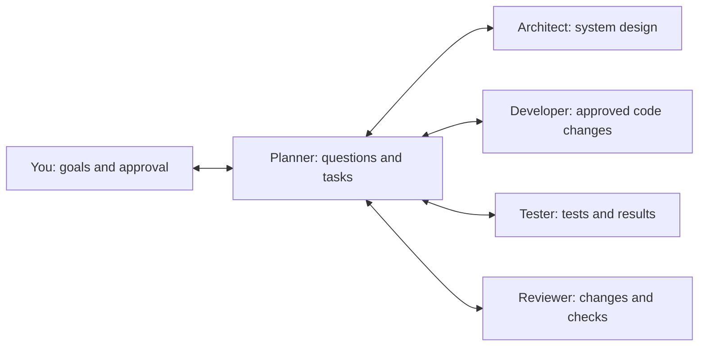

# No-nonsense AI Software Engineering: Work With Your Planner

## Who Decides?

The planner helps you ask questions, write requirements, and assign work. It does not approve its own work. You give the goal, project knowledge, and rules. You approve important decisions and the final result.



These are different jobs, not necessarily five agents. Use separate steps with one tool if that is enough. Use tests and a new review chat to reduce repeated assumptions. A role name or new chat alone does not prove an independent review.

The arrows show information sharing. They do not permit code changes before approval. Complete the [current-work worksheet](./experiments/baseline.md) first. Then use this guide with the [main lessons](./LESSON_PLAN.md).

## 1. State the Goal

Describe the problem, users, expected result, and known limits. Give one example. Link related project rules. Ask the planner to read nearby code and tests without changing them. Do not send every project file or select a design before the requirements are clear.

```text
Help me plan this feature. Do not write code or assign code changes yet.
Problem: support staff need to export the orders visible in their filtered view.
Result: a CSV file for checking orders, without exposing another customer's data.
Rules: keep the current access checks and API rules.
Read the current order query, access checks, and related tests.
Restate the goal. Separate facts from guesses.
Ask no more than three important questions at a time.
Explain which decision each answer will affect.
Do not make product decisions for me.
```

## 2. Answer Important Questions

Start with the goal and work included. Then ask about limits, errors, and rules that must always hold. Discuss the design when enough behavior is known. A useful question offers clear choices instead of asking "anything else?".

| Planner question | Why it matters | Example human decision |
| --- | --- | --- |
| Export the current page or all filtered results? | Changes the amount of data | All matching results, up to 5,000 rows |
| Which fields may be exported? | Changes what data can be shared | Only order ID, date, status, and total |
| What happens above the limit? | Changes error behavior and design | Show an error that explains what to do; no partial file |

Ask the planner to list **confirmed requirements**, **guesses**, **unanswered questions**, and **work for later**. A guess is not permission. If an important answer is unknown, investigate it or reduce the planned work. Do not let code decide the answer for you.

```text
Update the decision list with my answers.
List conflicting answers and questions that prevent work from continuing.
Suggest a small check to answer each important question.
Do not ask answered questions again unless new facts conflict with the answers.
```

## 3. Write the Specification

A specification describes the required behavior. Acceptance criteria are the results you must check before accepting the change. Use the [specification template](./templates/feature-spec.md). Give each result an ID, such as AC-1. Keep these IDs in tasks, tests, and reviews.

These export requirements are drafts. Do not approve the design until the file-safety and error rules below are agreed:

- **AC-1:** Export all matching orders for the caller's customer group, within the row limit. Include only the four approved fields.
- **AC-2:** Use the existing access checks. Users without permission must not receive order data.
- **AC-3:** If more than 5,000 rows match, return the agreed error and no partial file.
- **AC-4:** Encode commas, quotes, and newlines correctly. Apply the approved rule that prevents exported text from running as spreadsheet formulas.

**Not included:** Background jobs, email delivery, a new reporting system, or extra fields.

**Still to decide:** Agree the exact spreadsheet-safety rule and error response before design approval. Your project can need different rules. This example is not a complete export specification for every system.

```text
Write a specification from confirmed decisions.
Give each acceptance requirement an ID.
Include examples, error cases, and a planned check for each requirement.
List unanswered questions, conflicting rules, and extra work not yet approved.
Do not mark the specification approved until I approve it.
```

## 4. Ask the Architect to Check the Design

The architect checks the system's main parts and how they work together. Give it the approved goal, draft specification, existing rules, and unanswered design questions. Ask for the simplest suitable choice. Compare another choice only when there is a useful difference.

For the export, compare a direct response using the existing customer data query with a separate background job. The direct response may be simpler. Check access rules, fields, speed, and API behavior before selecting it. A row limit alone does not prove safe operation.

```text
Check the export plan against the existing design.
State who owns the data and which access rules must remain unchanged.
Check shared inputs, outputs, errors, and which code parts can call each other.
List speed risks and how to undo the change.
Prefer existing parts. List decisions that need my approval.
If the simple choice is unsafe, explain why.
Suggest a small investigation before adding a new system.
```

Record your choice, reasons, costs, risks, and any choice you rejected. You approve it. The planner updates the specification and task limits. If design work changes required behavior, update and approve the specification again.

## 5. Approve Each Important Step

A gate is an approval step. Record its status, supporting facts or test results, and your decision. `pending` means you have not decided. `passed` means you approved it. `blocked` means work cannot continue. The planner suggests a decision. You decide.

| Gate | What you need | Your decision |
| --- | --- | --- |
| G1: Goal ready | Goal, work included, limits, and answered questions | Approve what to build |
| G2: Design ready | Testable specification, shared interface rules, and a checked design | Approve the specification and design |
| G3: Task ready | Small task, required earlier work, allowed changes, test commands, and stop rules | Approve the next code task |
| G4: Change checked | Actual results for each requirement, reviewed changes, and resolved important findings | Accept the result or ask for corrections |

Do not pass G1 or G2 while important questions for that step remain unanswered. For a small, low-risk task, combine G1-G3 into one approval. Use separate approvals and stronger checks for risky changes. You do not need an automatic gate tool.

## 6. Assign Clear Tasks

Use the [task template](./templates/agent-task.md). The planner can draft tasks early and update them after G2. You approve each code task at G3. Before work runs at the same time, approve the shared input and output rules.

| Role | Receives | Returns | Must not do |
| --- | --- | --- | --- |
| Architect | Goal, specification, existing design rules, questions | Choices, risks, and a suggested design | Decide product requirements for you |
| Developer | Approved design, task, requirement IDs, checks | Code changes and actual check results | Add extra work or approve itself |
| Tester | Required behavior, IDs, interface rules, working code | Error cases and test results | Decide expected behavior only from the new code |
| Reviewer | Approved plan, changes, and actual results | Problems listed by importance, with supporting facts | Treat AI confidence as proof |
| Planner | Requirements, decisions, tasks, and findings | Updated plan and suggested next step | Override your decisions or hide failures |

Do not write only "build CSV export." State the expected behavior, access rules, test commands, and reasons to stop. Include the requirement IDs. The developer must stop if it needs to change an approved rule or shared interface.

## 7. Update the Plan When Facts Change

```text
List approval status and actual check results.
Separate checked facts from claims that have not been checked.
If a requirement, design rule, shared interface, or important assumption changes,
show what must change in the specification, tasks, and tests.
Stop affected code work. Ask me to approve the new plan.
Do not hide a test failure by weakening the requirement or expected result.
```

A local bug fix within approved rules does not need every approval again. Changed requirements, shared interfaces, or design rules need new approval for affected work. Keep the failed test results. They show what the fix must correct.

## Example: Approve an Export Task

**Example only:** This is an invented project. No code or tests from it were run here. Suppose it already has a query limited to each customer group. It also has approved rules for CSV output and export errors. Check these facts in your own project before using the plan.

CSV files store rows of values separated by commas. The output code must also handle special characters and spreadsheet-safety rules.

**Planner's first suggestion:** "T1: add the export route and tests. G3 ready; run the tests."

**Your response:** "G3 blocked. Name the approved query and output rules. State the row limit, allowed changes, and exact checks. Agree the export rules at G2 first. Do not write code yet."

The planner asks the architect and tester to inspect the plan without code changes. In this example, the existing output rules answer AC-4. The error rules answer AC-3. The architect suggests a direct response using the existing parts. You still need access and performance check results before G2. If these results are missing, keep G2 blocked and ask for a small investigation.

**Your decision after checking those results:** "Approve specification v2 and the reviewed query design at G2. Keep the row limit and existing export rules. Do not add a job queue or change access rules. Update T1."

### Updated T1: Order Export

| Item | Approved task in this example |
| --- | --- |
| Goal | Add the export route for AC-1 through AC-4 in specification v2 |
| Information | Approved query, access checks, output rules, error rules, and related request tests |
| Required first | G2 approval, agreed interface rules, and design investigation results |
| Allowed changes | Export route and related tests. Reuse the query and output code. Keep their shared interfaces unchanged. |
| Limits | Export all matching orders for the caller's customer group, within the limit. Include four approved fields. Reject more than 5,000 rows with no partial file. |
| Checks | All matching pages, separate customer data, access denied, 5,000 and 5,001 rows, CSV format and safety, existing tests, and build |
| Stop if | The query cannot limit data to a customer, output rules do not fit, or shared interfaces must change |
| Return | Code changes, commands run, actual results by requirement ID, and problems still open |

Record test commands before G3. In a .NET project with matching test names, one command could be:

```powershell
dotnet test --filter "FullyQualifiedName~OrderExport"
```

This command was **not run** here. Use commands and test names from your project. Run the required existing tests and build checks too. A command that runs no tests does not prove success.

**Your task decision:** "Approve T1 at G3 against specification v2 and the recorded checks. Change only this task's code. Stop if approved rules must change."

### A Failed Check Stops Acceptance

Suppose output tests pass, but a request test finds another customer's row. The planner must report **AC-2 failed; G4 blocked**, not "mostly done."

**Your response:** "Do not accept the change or weaken AC-2. Correct the query use within approved rules. Keep the failed case as a test. Rerun the affected tests and checks for existing behavior."

This table shows **required results for the example**, not actual test output:

| Requirement | Required result |
| --- | --- |
| AC-1 | Request tests confirm filters, all pages within the limit, and exact fields |
| AC-2 | The failed customer-separation test now passes. Access-denied cases and required existing tests also pass. |
| AC-3 | 5,000 rows succeed. 5,001 rows return the approved error and no partial file. |
| AC-4 | CSV format and spreadsheet-safety tests pass against approved output rules |

Replace these descriptions with actual results for the final code version. The reviewer checks code changes, design rules, and important findings. Only then say: "Accept this version at G4 against the linked results." A local bug fix does not automatically need G2 again. A changed query or access interface does.

## Review Your Method

Use this guide with the lesson exercise. Do not repeat the example as extra homework. Record unclear requirements found before coding, corrections, errors, and review effort. Did the planner help you make better decisions, or only write more documents?

Keep the approved specification, needed design decisions, tasks, and results in your project. Do not keep them only in the chat.

**Avoid:** "Planner, make a complete plan and assign everyone." This lets the AI decide unanswered requirements and approvals.

**Use:** "Planner, help me answer the next important question. Suggest a small, testable plan. Wait for my approval."